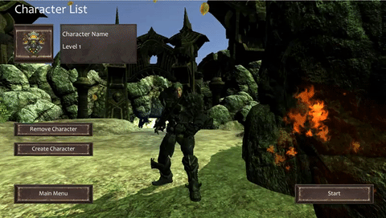
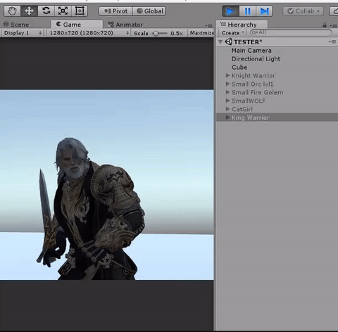
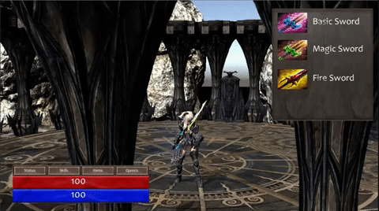
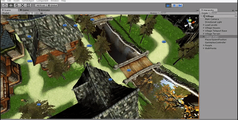

# RPG Prototype Scripts

-- This is a page that allows me to save my scripts on a public repository to share them with ease, without making the main repo (and the sounds and 3D assets, that I do not own) public --

RPG Prototype made with the intent to have a sandbox playground to create gameplay elements made with Unity thanks to the courses and assets from Awesome Tuts (yt link : [https://www.youtube.com/channel/UC5c-DuzPdH9iaWYdI0v0uzw)  
Works with Unity 2019.1.0a12

Project made with Unity 2019.1.0a12.
The executable file link will be included in the final commit.

Here are a few examples of what I'm trying to achieve with this project :
> **Creating a 3D RPG with multiple character choices and story lines :** 

> **Allow the player to loot multiple weapons and stuff** 

> **Allow the player to have interaction and transaction with NPC**

> **Allow the player to do quests and to complete them**

TODO LIST :

- [Gameplay] Handle the story events by script files.
- [UI] Localization
- [FX] Adding shaders effects to spice visual effects up a bit
- [FX] refine the particles
- [Animation] refine characters animation
- [Gameplay] Refine combat interactions
- [Gameplay & UI] Add cinematics and create characters Icons/Portraits for the interactions with NPC
- [Gameplay] Create story lines for each characters.
- [Gameplay] Create interactions with the NPC and allow the player to purchase/sell items to them
- [Gameplay] Allow player to use healing items
- [Gameplay] Manage skills and skill points
- [Gameplay] Add a map and map interactions
- [Gameplay] Add notifications / success / achievements system
- [System] Add save/load state for the world environment & other settings (not the highest priority)

WIP :
- [Gameplay] Add a journal/log that will contains actions done by the player and objectives
- [UI] : Add Menus / Logs events / and manage skill points 
- [Gameplay] Handling the inventory items by JSON file.

DONE :

- ~~[Gameplay] : Select a character and start the game with this character~~
- ~~[Gameplay] : 3 Characters & animations + different spells available~~
- ~~[Gameplay] : Multiple worlds to visit and enemies to fight~~
- ~~[IA] : A town in which NPC are walking~~
- ~~[Gameplay] : Multiple Weapons for the player~~
- ~~[System] : Add Save player state to a file & Load function to get a player state from a file~~
- ~~[Sound] : Add sounds to player, characters & ambiant for the scenes, + some music~~
- ~~[UI] : Add enemies health bars and switch health bar by "tab" key system + Add circle shader at feet of characters (green = allies, red = enemies)~~

DROPPED IDEAS :

/// 
